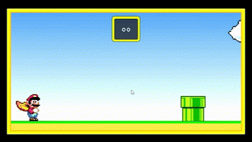

<h1 align="center">
    
</h1>

Este é mais um dos projetos que fiz nessa minha saga de estudos. Sendo esse um desafio de se pensar em como projeta-lo.

Para quem quiser experimenta-lo, [clique aqui.](https://cmp-projeto-mario.netlify.app/)

    

---

## Sobre o Projeto

Bom, como eu já tinha dito, o CMP - Projeto Mario faz parte dos meus estudos. Esse projeto visa a utilização de keyframes para da mais dinamismo ao jogo, o que o torna mais vivo. 

    

Além disso, falando de JavaScript, a sua lógica foi baseada no uso de setInterval e setTimeout, o que nos permitiu simular colisão de objetos e verificar o andamento do jogo a todo instante.

Sendo assim, a reutilização de animações e o cancelamento delas se tornou possivel já que, com esse loop de verificação o jogo retirava e adicionava classes dos obejetos constantemente.

    

---
## Bug's
Exite um bug que as vezes o contador de pontos não vai ser preciso, tem vezes que não conta e tem vezes que ele conta dobrado. Até o momento esse foi o unico bug que eu encontrei.

---

## Dificuldades e Aprendizado

Pelo fato de está no processo de estudo de JavaScript, não tenho uma mente aflorada no que diz respeito a lógica. Para mim fazer com que você tivesse uma pontuação e que ela se somasse foi algo que eu quebrei um pouco a cabeça de começo, mas que se mostrou algo mais simples do que parece no final do processo.

O que mais me fez pensar, foi conseguir fazer aparecer na tela de game over a pontuação do player, pois não sabia como pegar essa informação e realoca-la, mas após muito pensar utilizando const foi possivel utilizar essa informação posteriormente.

    

Esse projeto me ajudou muito no aprendizado e no exercitar do raciocínio. Analizar, refletir, refazer, metodos que agora se tornaram mais simples e com a pratica, mais constantes.

---

    

---